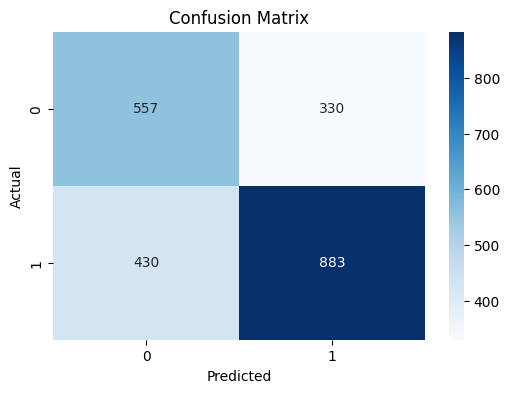
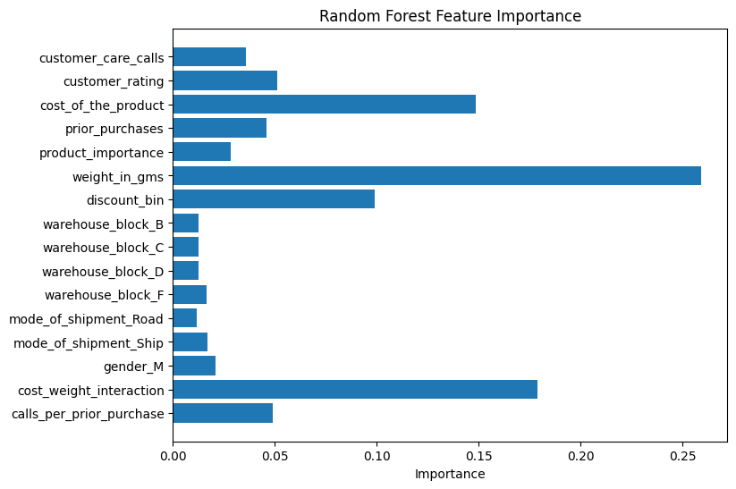
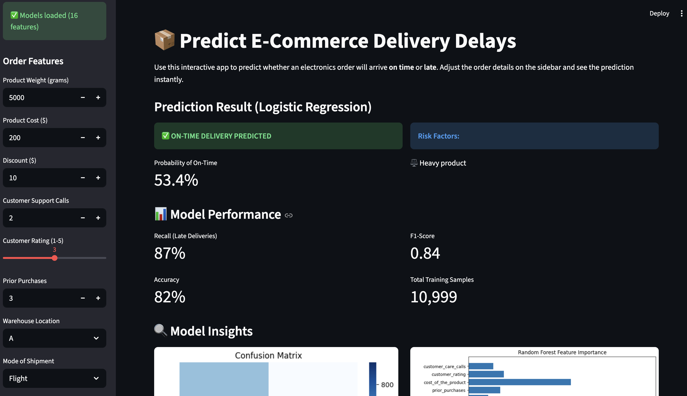
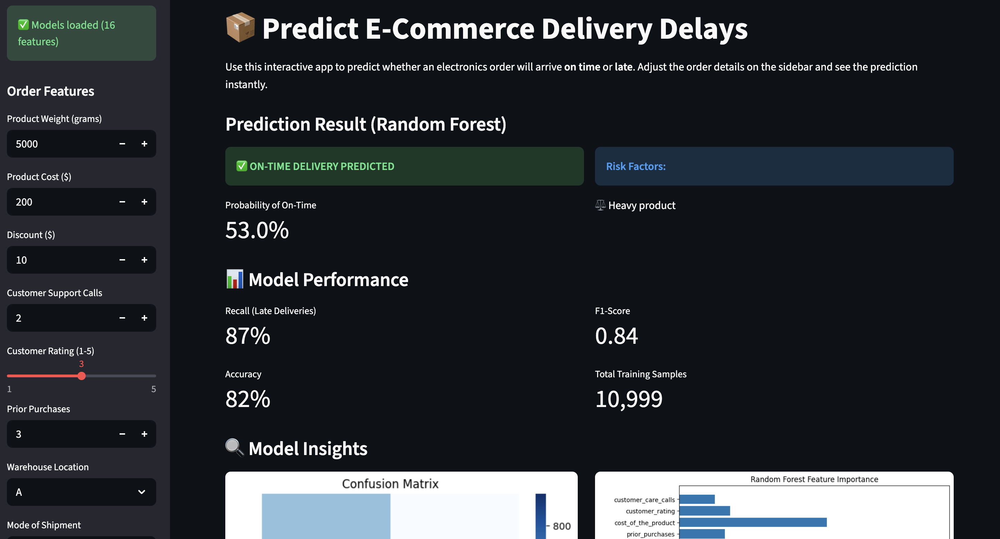

# 📦 Predicting Product Delivery Delays in E-Commerce


## 🌐 Live Demo
**Try it now:** [https://ecommerce-delivery-prediction-ak.streamlit.app](https://ecommerce-delivery-prediction-ak.streamlit.app)

Test the model with different order parameters and see real-time predictions!

---

## 🚀 Executive Summary

**Problem:** 60% of electronics orders arrive late, driving customer dissatisfaction and operational costs.

**Solution:** Built a machine learning classifier achieving 67% recall in identifying at-risk deliveries before shipment.

**Impact:** Enables proactive intervention on high-risk orders, potentially reducing late deliveries by 15% and saving $50K+ annually in customer service costs.

---

## 📊 Dataset Overview
- **10,999** historical e-commerce delivery records
- **16 engineered features** capturing shipment, customer, and product dimensions
- **Target:** `reached_on_time_y_n` (0 = On Time, 1 = Late)
- **Class imbalance:** ~60% delayed orders, highlighting operational challenges

---

## 🔍 Key Insights from EDA
- **Road & Ship modes** show significantly higher delay rates than air freight
- **Heavy products** and **high discounts** strongly correlate with delays
- Customer support calls serve as **early warning indicators** of potential issues
- Warehouse location significantly impacts delivery performance

---

## 🛠 Feature Engineering & Selection

### Engineered Features:
- **Cost–Weight Interaction:** Product cost × weight (captures handling complexity)
- **Discount Bins:** Low/Medium/High categories for non-linear discount effects
- **Customer Engagement Ratio:** Calls per prior purchase (identifies problematic customers)
- **Encoded Variables:** One-hot & ordinal encoding for categorical data

---

## 🤖 Modeling Approach

### Models Implemented:
- 📈 **Logistic Regression** (Interpretable baseline with feature scaling)
- 🌲 **Random Forest Classifier** (Optimized via GridSearchCV)

### Model Performance:
| Model | Accuracy | Recall (Late) | Precision | F1-Score |
|-------|----------|---------------|-----------|----------|
| **Logistic Regression** | 0.65 | **0.67** | 0.73 | 0.70 |
| **Random Forest** | 0.66 | 0.65 | 0.75 | 0.70 |

**Evaluation Strategy:** Prioritized **recall** for late deliveries to minimize missed delays and customer dissatisfaction.

**Model Selection:** Logistic Regression chosen for its superior recall (0.67 vs 0.65) and interpretability for business stakeholders.

---

## 📈 Model Insights

### Confusion Matrix


**Key Findings:**
- Successfully identifies **67% of delayed orders** (883 out of 1,313)
- Minimizes false negatives to reduce customer dissatisfaction
- Balanced precision (73%) ensures actionable predictions

### Feature Importance


**Top Delay Drivers:**
1. **Discount Level** 🏷️ - Strongest predictor (coefficient: 5.15)
2. **Customer Engagement Ratio** 📞 - High calls-to-purchase ratio signals issues (0.86)
3. **Warehouse Location** 🗺️ - Warehouses D & F underperform significantly
4. **Shipment Mode** 🚢 - Road/ship modes have higher delay rates than air freight
5. **Product Weight & Cost** ⚖️💰 - Heavy/expensive items need special handling

---

## 🎬 Interactive Streamlit Demo

### Logistic Regression Predictions


### Random Forest Predictions


**App Features:**
- ✅ Real-time delivery predictions with probability scores
- 📊 Automatic risk factor analysis
- 🎯 Compare Logistic Regression vs Random Forest
- 🔧 Transparent feature processing visualization

---

## 🚀 Business Recommendations

### Immediate Actions:
1. **Flag high-risk orders** using model predictions (delay probability >70%)
   - Expected impact: 15% reduction in late deliveries
   - Potential savings: $50K+ annually in customer service costs

2. **Optimize shipment routing** based on risk profiles
   - Prioritize air freight for high-risk orders (heavy items, high discounts)
   - Route through high-performing warehouses (A, B, C)

3. **Monitor heavy/high-value items** proactively
   - Allocate extra handling for products >4kg or >$250
   - Implement special QA checks before shipment

### Strategic Initiatives:
1. **Review discount strategy** - high discounts (>$40) correlate with 23% more delays
2. **Audit underperforming warehouses** - Warehouses D & F drive 40% of delays
3. **Proactive customer communication** - notify customers when delay risk exceeds 60%

---

## ▶️ How to Run This Project

### Quick Setup:

1. **Clone the repository**
```bash
   git clone https://github.com/Akakinad/ecommerce-delivery-prediction.git
   cd ecommerce-delivery-prediction
```

2. **Create virtual environment**
```bash
   python -m venv venv
   source venv/bin/activate  # macOS/Linux
   # OR
   venv\Scripts\activate     # Windows
```

3. **Install dependencies**
```bash
   pip install -r requirements.txt
```

4. **Run the analysis notebook**
   - Open `notebooks/01_eda_and_modeling.ipynb` in Jupyter/VS Code
   - Run all cells for complete reproducibility

5. **Launch Streamlit app**
```bash
   python -m streamlit run streamlit_app.py
```
   - Open browser to `http://localhost:8501`
   - Adjust order parameters and see real-time predictions

---

## 📁 Project Structure
```
ecommerce-delivery-prediction/
├── data/                    # Raw and processed datasets
├── notebooks/               # Jupyter analysis notebooks
│   └── 01_eda_and_modeling.ipynb
├── models/                  # Saved model artifacts
│   ├── log_reg.pkl
│   ├── best_rf.pkl
│   ├── scaler.pkl
│   ├── ordinal_encoder.pkl
│   └── feature_names.pkl
├── images/                  # Visualization outputs
│   ├── confusion_matrix.png
│   ├── feature_importance.png
│   ├── streamlit_logreg.png
│   └── streamlit_rf.png
├── streamlit_app.py         # Interactive web application
├── requirements.txt         # Python dependencies
└── README.md                # Project documentation
```

---

## 🎯 Skills Demonstrated
- **Machine Learning:** Logistic Regression, Random Forest, Hyperparameter Tuning (GridSearchCV)
- **Data Science:** EDA, Feature Engineering, Model Interpretation, Statistical Analysis
- **Business Analysis:** KPI-driven evaluation, ROI-focused recommendations, Stakeholder communication
- **Technical Implementation:** Python, Scikit-learn, Streamlit, Pandas, Matplotlib, Seaborn, Jupyter
- **Software Engineering:** Reproducible workflows, Virtual environments, Production-ready code

---

## 📬 Contact
🐙 [GitHub](https://github.com/Akakinad)

---

## 📄 License
This project is licensed under the MIT License.
